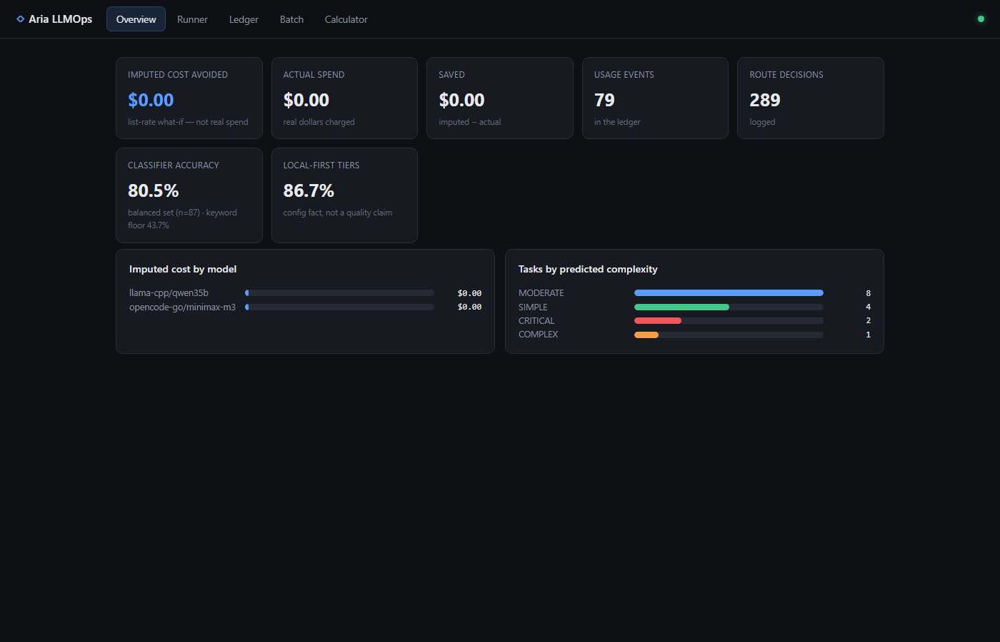
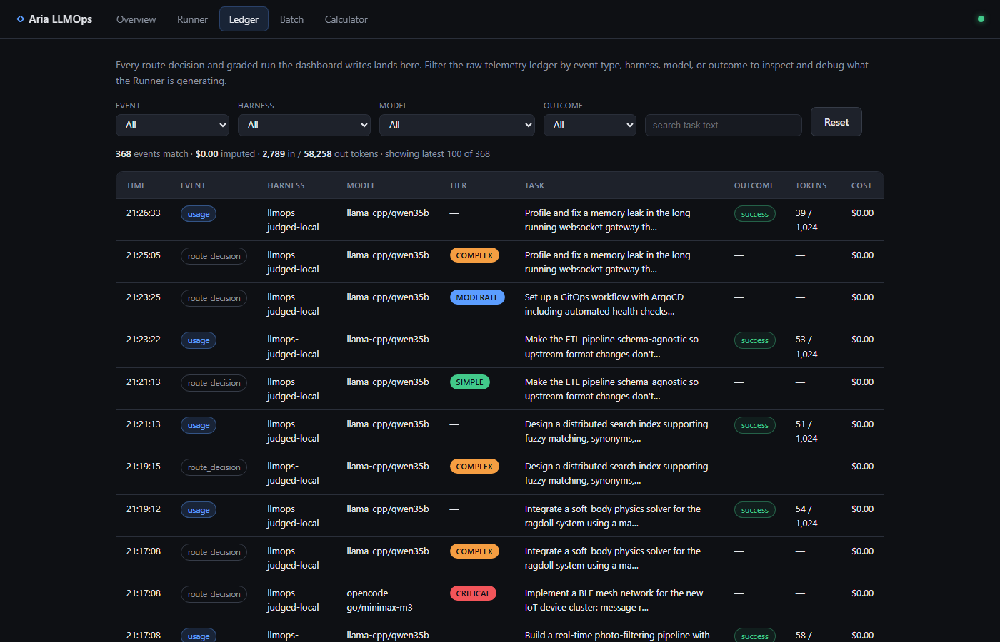

# aria-llmops

[](https://github.com/chaitea321/aria-llmops/actions/workflows/ci.yml)

-success)

[](LICENSE)

Route every AI task to the **cheapest model that can actually handle it** — and
prove the savings with honest, reproducible telemetry. A from-scratch,
**standard-library-only** LLMOps layer measured on its own real usage. The Aria
iOS music app is the test bed; **this repo is the deliverable**, and the
measured numbers below are its evidence.

## Try it in three commands (no models required)

```bash
git clone https://github.com/chaitea321/aria-llmops && cd aria-llmops
python3 dashboard/server.py          # stdlib only — nothing to install
# open http://127.0.0.1:7799 -> Batch tab -> "Run batch"
```

That batch-routes an 87-task labeled dataset through the keyword classifier and
lights up the whole dashboard: routing decisions in the ledger, a live confusion
matrix, tier distributions. Add any OpenAI-compatible local model (Ollama,
LM Studio, llama.cpp) to upgrade the classifier and enable execution — see
[configs/](configs/README.md).

## The five features

| | Feature | Where |
|---|---|---|
| 1 | **Tier router** — SIMPLE/MODERATE/COMPLEX/CRITICAL classification (keyword floor + local-model rescue), cheapest-capable routing, rolling budget caps | `llmops.py` |
| 2 | **Task Runner** — route → optionally execute locally → grade the outcome → capture a labeled example | dashboard **Runner** |
| 3 | **Batch evals** — route a whole labeled dataset in one click → confusion matrix + per-task agreement | dashboard **Batch** |
| 4 | **Telemetry ledger** — append-only JSONL, idempotent ingest, imputed-vs-actual cost accounting, faceted explorer | dashboard **Ledger** |
| 5 | **Savings calculator** — human vs naive-AI vs routed-AI economics, every input provenance-tagged | dashboard **Calculator** |

Docs: start at [openwiki/quickstart.md](openwiki/quickstart.md) — an 8-page
wiki generated from this codebase (and kept honest by fact-checking against it).





<sub>More: [Runner](docs/img/pane-runner.png) · [Batch](docs/img/pane-batch.png) · [Calculator](docs/img/pane-calculator.png). Deep-link any pane: `/#runner`, `/#batch`, …</sub>

## The loop

Everything here exists to close one loop:

```
  measure  ->  route  ->  execute  ->  grade  ->  evaluate  ->  tune
  (ledger)   (router)   (local 35B)    (9B)       (evals)
```

1. **Measure** — every model call (Claude Code sessions via hook/backfill,
   routed local calls) lands in one idempotent JSONL ledger with token counts
   and imputed USD at list rates.
2. **Route** — `ModelRouter` classifies task complexity (keyword-first +
   9B-rescue hybrid) and picks the cheapest viable model, gated by rolling
   5h/7d/30d budgets.
3. **Execute** — local tiers run on a self-hosted 35B MoE behind a single
   llama-swap endpoint; cloud tiers are decided (and priced) but not executed
   from this process.
4. **Grade** — session outcomes come from user reactions: keyword heuristic
   first, a 9B model grader for the inconclusive middle.
5. **Evaluate** — the evals turn the ledger + labeled datasets into accuracy,
   efficiency, and quality numbers, including the failure modes.

This loop ran end-to-end for real on 2026-07-09; the numbers in this README
come from that run and are reproducible with the commands shown.

## Architecture

```
 Claude Code sessions      opencode / CLI            llmops-local (run_task)
        | SessionEnd hook         | route_decision            | usage
        v                         v                           v
   telemetry/ingest_claude_code -----> telemetry/events.jsonl (append-only,
        (idempotent, defensive)          idempotent ledger; gitignored data)
                                                    |
        +--------------------+----------------------+-------------------+
        v                    v                      v                   v
  telemetry.py report   evals/ (accuracy,      dashboard/          reprice /
                        efficiency, quality)   (5-pane live UI     backfill-outcomes
                                                + static export)

  ModelRouter (llmops.py)
    classify_hybrid: keyword-first, 9B-rescue on keyword default
    CostMonitor: rolling 5h/7d/30d windows, 80% force-local gate
    execution: LocalLlamaClient -> llama-swap :8080
               qwen3.6-35b (executor) / 9b-mythos (classifier)

  calculator/ (savings model)  <- measured defaults from the live run
```

## Quickstart

Runtime is stdlib-only (Python 3.9+). pytest is dev-only.

```bash
python3 dashboard/server.py                      # the 5-pane live dashboard :7799
python3 -m venv .venv && .venv/bin/pip install -r requirements-dev.txt
.venv/bin/python -m pytest tests/ -q     # full suite (dev-only dep)
python3 telemetry.py ingest claude-code --all    # backfill your sessions
python3 telemetry.py report
python3 telemetry.py eval all
python3 telemetry.py dashboard                   # static export (dashboard/index.html)
python3 calculator/savings_model.py              # the business savings model
```

(Windows: `.venv\Scripts\python.exe`; use `python3.13` explicitly if your
`python` is older than 3.9.)

### Local inference (any OpenAI-compatible endpoint)

The router defaults to the author's topology: one llama-swap endpoint at
`http://localhost:8080/v1` serving both models by key. **To use your own
models** (Ollama, LM Studio, plain `llama-server`), point
`LLMOPS_MODEL_CONFIG` at a preset in [configs/](configs/README.md) — tier
chains and pricing move to a JSON file, no code edits. Env vars override
everything:

| Var | Default | Meaning |
|---|---|---|
| `LLMOPS_INFERENCE_MODE` | `swap` | `swap` = one endpoint; `dual` = legacy two-port |
| `LLMOPS_SWAP_ENDPOINT` | `http://localhost:8080/v1` | the one endpoint (swap mode) |
| `LLMOPS_LOCAL_MODEL` | `qwen3.6-35b` | executor model key |
| `LLMOPS_CLASSIFIER_MODEL` | `9b-mythos` | classifier model key |
| `LLMOPS_MODEL_CALL_TIMEOUT` | `45` | classify/grade timeout — must cover llama-swap swap-in (~14s measured) |

Route (and locally execute) a task:

```bash
python3 llmops.py --task "add a retry to the download path" --run
```

## Real numbers (2026-07-09, RX 7600 XT 16 GB / 32 GB RAM, q4 quants)

**Treat every number here as small-N evidence, not statistics.** Reproduce
with the listed command; model-involved numbers wobble run to run (the 9B is
non-deterministic).

### Classification — `evals/classifier_comparison.py`

| strategy | keyword-tuned (n=24) | prose-blind (n=18) | union (n=42) |
|---|---|---|---|
| keyword | 1.000 | 0.333 | 0.714 |
| 9B-primary | 0.917 | 0.611 | 0.810 |
| **hybrid (production)** | **1.000** | **0.667** | **0.833** |

The hybrid is ≥ both parents on every dataset — the design claim ("the two
classifiers fail on disjoint inputs") as a measured result: keyword keeps its
perfect tuned-set score (where the 9B's blind spots cost it 0.917) and the 9B
rescue lifts keyword-blind prose from 0.333 to 0.667.

Read with the caveats: the keyword-tuned set is the **tuning target**
(keyword 1.0 is self-fulfilling — the dashboard now labels it as such and
headlines the prose-blind number instead); prose labels are authored/curated;
the 9B wobbles.

### The live routing run — `evals/live_routing_ab.py` (n=12 labeled tasks)

The whole loop, live: route -> execute on the 35B -> grade -> quality eval.
Full evidence in `evals/live-runs/` (outputs, reviewer reactions verbatim,
aggregates).

| Metric | Value |
|---|---|
| Tier accuracy vs labels | hybrid **10/12**, 9B-primary **10/12** — both misses are the two *documented* 9B under-provisioning blind spots, reproduced live |
| Local executions | **11/11 completed**; the CRITICAL task correctly routed to cloud (not executed) |
| Outcomes (graded) | **8 success / 3 failure** -> local success rate **0.727** |
| Execution wall | 73.7–143.8 s (mean 116.5) at ≤800 output tokens, swap-ins included |
| Tokens / imputed cost | 295 in / 8,288 out -> **$0.00** (self-hosted) |
| Classifier latency | 2.4 s resident, ~14.1 s when llama-swap swaps it in |

Failure anatomy (all auditable in `records.jsonl`): one genuine capability
miss (SwiftUI code that doesn't compile), one missed-the-ask, one truncation
casualty — 7/11 outputs hit the 800-token cap, so treat 0.727 as a **floor**
for a properly configured deployment.

`telemetry.py eval quality` over that run's ledger: `cheap_routing_failures`
flagged exactly the three failed local sessions — the eval's "did cheap
routing hurt?" question answered with real data for the first time.

### The scaled judged run — `evals/batch_execute_judged.py` (n=87, 2026-07-13)

One command routed the whole balanced set through the production router,
executed the local-routed tasks on the 35B, and judged outcomes with the local
9B (fixed rubric, temperature 0):

| Metric | Value |
|---|---|
| Executed locally | 64/87 — all 22 CRITICALs correctly routed to cloud instead; 1 local transport error |
| Judge-passed | 63/64 (0.984) — SIMPLE 19/19 · MODERATE 22/22 · COMPLEX 22/23 |
| Output-cap hits | 38/64 at 1,024 tokens (the n=12 run's truncation finding, reproduced at scale) |
| Wall time | median 106.6 s/task · 2.0 h total · **$0.00** (self-hosted) |

**Do not read 0.984 as quality.** The judge asks *"is this a plausible,
on-topic attempt?"* — a far weaker bar than the human-graded run's *"did it
actually work"* (0.727, n=12). The gap between those two numbers is itself the
finding: plausibility is nearly always high; verified correctness is not. Use
these weak labels for volume, trends, and failure mining — never as a success
claim. Full provenance (judge model, prompt, per-task records):
`evals/results/judged_run_2026-07-13.json`; the cohort is isolated in the
ledger under `harness=llmops-judged-local`.

### The business savings model — `calculator/savings_model.py`

Defaults (2,000 tasks/mo, 6 min/task @ $35/h loaded, agentic 4-call tasks,
measured 0.727 local success): routed automation nets a client
**~$4,269/month vs doing it with people** (payback on a $3k setup fee: **0.7
months**) — while vs an *existing* naive frontier-AI setup it only wins at
~10k+ tasks/month. At list rates the local box pays for itself around **~234k
tasks/month**; below that the calculator recommends cloud-only and says the
box is a privacy/rate-limit play, not a cost play. Every input carries a
provenance tag (measured / list-rate / assumption); the honesty block is part
of the output.

## CLI reference

| Command | What it does |
|---|---|
| `telemetry.py ingest claude-code [--session F \| --project-dir D]` | parse transcripts into usage events (idempotent) |
| `telemetry.py report` | ledger totals + by-outcome breakdown |
| `telemetry.py eval [classification\|efficiency\|quality\|all] [--model-classifier]` | run evals |
| `telemetry.py dashboard [--out F]` | self-contained HTML dashboard |
| `telemetry.py suggest` | keyword-classifier mismatches vs the labeled set |
| `telemetry.py reprice [--write]` | recompute imputed_usd at current rates |
| `telemetry.py backfill-outcomes [--write] [--grade-with-model]` | stamp outcomes onto existing events |
| `llmops.py --task T [--run] [--classifier keyword\|model]` | route (and optionally execute) a task |
| `llmops.py --store --problem P --solution S --cost C` | record a solved problem + spend |
| `llmops.py --report [--by-area] [--by-pattern]` | cost/memory report |
| `evals/live_routing_ab.py run\|grade\|report` | the live routing A/B harness |
| `calculator/savings_model.py [--json]` | the business savings model |

## The evals — what each measures, and what it does NOT

- **router_classification_eval** — accuracy vs `datasets/labeled_tasks.jsonl`
  (keyword-tuned: the keywords were written against it) and
  `labeled_tasks_prose.jsonl` (keyword-blind: 8 rows from the real ledger, 10
  authored). *Not* a claim about real-traffic accuracy.
- **classifier_comparison** — keyword vs 9B-primary vs hybrid on both sets +
  union. Needs the 9B live; non-deterministic.
- **routing_efficiency_eval** — replays ledger sessions through the router;
  `local_first_sessions_pct` restates the TIER_PREFERENCE config as judged by
  the classifier. *Not* an output-quality measurement.
- **routing_quality_eval** — joins outcomes onto spend:
  `cheap_routing_failures` (did cheap routing hurt?) and
  `downgrade_candidates` / `strong_downgrade_candidates` (where is frontier
  spend unjustified?). Outcomes are heuristic labels; unlabeled sessions are
  never assumed.
- **live_routing_ab** — the live loop; produced the run above.
- **headroom_fidelity_eval** — historical evidence for a context-compression
  decision; needs the iOS repo + a pinned third-party package (eval-only);
  results committed in `evals/headroom-results.json`.

## Where this is going

This repo is the measured foundation for a **token-cost-conscious automation
service**: automate a business's repetitive task streams, route every call to
the cheapest capable tier, and report actual savings monthly against the
numbers predicted at signing. `calculator/` is the sales instrument;
`docs/specs/2026-07-09-business-roadmap.md` maps the six-stage modular
pipeline (only connectors + QA policy are per-client — stages 2–6 are this
repo) and the honest gap analysis.

## Limitations (read before believing any number)

- **Small N.** 12 live-routed tasks, 42 labeled rows, one box, one workload.
- **The 9B is non-deterministic** with stable under-provisioning blind spots
  (data-race severity, audio-engine integration) — reproduced in three
  consecutive runs. That is exactly why production classification is
  keyword-FIRST with the 9B as rescue.
- **Prose dataset labels are authored/curated**; the keyword-tuned set is
  circular by construction and reported only as a tuning target.
- **Imputed cost is list-rate accounting** of subscription usage — what it
  *would* cost, not money spent.
- **Outcomes are heuristic**: keyword phrases + a 9B grader; the live run's
  reactions were authored by the run's reviewer and recorded verbatim for
  audit.
- **Topology**: one llama-swap endpoint serves both models but **swaps on
  demand — not co-resident**. Measured: 2.4 s resident classify vs ~14.1 s
  swapped-in; alternating classify/execute pays that both ways. True
  co-residency needs group-pinning + VRAM budgeting (unverified config sketch
  in PR #14).
- **Cloud tiers are priced, not executed** from this process.
- **The savings calculator is a model**: measured where it can be, labeled
  assumption everywhere else, and its recommendation logic is only as good as
  its inputs. It is a conversation instrument, not an invoice.

## Repo layout

```
llmops.py                router, cost monitor, coding memory, local client (stdlib)
telemetry.py             CLI: ingest/report/eval/dashboard/suggest/reprice/backfill
telemetry/               schema (ledger), ingest, outcomes, pricing, reprice, hooks/
evals/                   eval suite + datasets/ + live-runs/ (committed evidence)
dashboard/               static HTML generator (no server, no CDN)
calculator/              business savings model (stdlib, measured defaults)
tests/                   pytest suite (dev-only dependency)
docs/                    design, plan, and business-roadmap documents
```

## Claude Code hook

A `SessionEnd` hook in `~/.claude/settings.json` runs
`telemetry/hooks/claude_code_session_end.py` to auto-ingest each session into
the ledger. It always exits 0 — telemetry must never break a session.
